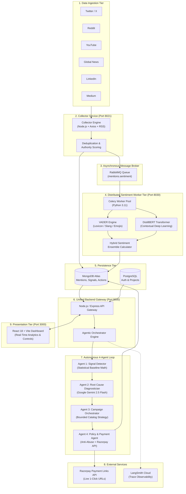
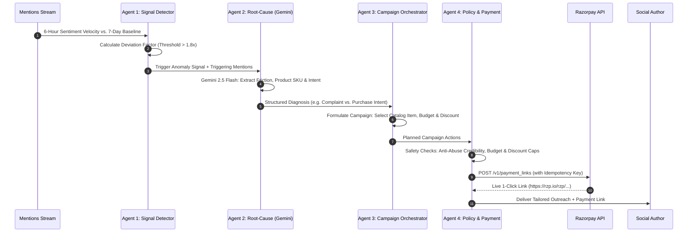

# SentiMind 🧠⚡
> **Autonomous Real-Time Brand Sentiment Intelligence & Conversational Commerce Platform**

[](https://nodejs.org)
[](https://www.python.org)
[](https://react.dev)
[](https://vitejs.dev)
[](https://docs.celeryq.dev)
[](https://www.rabbitmq.com)
[](https://razorpay.com)
[](https://deepmind.google/technologies/gemini/)
[](https://smith.langchain.com)

---

## 📌 Executive Overview: What is SentiMind?

Traditional social listening software (Brandwatch, Sprinklr, Talkwalker) is purely **passive and descriptive** — it displays backward-looking charts informing you that *"brand sentiment dropped 4% yesterday."* By then, unhappy customers have already switched to competitors, and viral sales opportunities have vanished.

**SentiMind** closes the gap between **listening, deep semantic diagnosis, and autonomous commercial action**. It continuously captures brand mentions across **6 diverse digital channels**, performs asynchronous hybrid NLP sentiment classification, and deploys a **4-Agent Autonomous AI Loop** that generates **live Razorpay checkout links** and **resolution vouchers** in seconds.

```
  [Scattered Social Chatter] ──► [Hybrid NLP Intelligence] ──► [4-Agent Autonomous Loop] ──► [Live Razorpay Commerce]
```

📖 **For detailed market statistics, churn facts, influencer scoring formulas, and paid vs. free firehose analysis, read [BUSINESS_LOGIC_AND_ARCHITECTURE.md](./BUSINESS_LOGIC_AND_ARCHITECTURE.md).**

---

## 🌐 1. Multi-Platform Mention Gathering

Consumers share opinions across fragmented online silos. SentiMind unifies brand conversations from **6 distinct platforms**:

| Platform | Source Mechanism | Data Captured | Business Relevance |
| :--- | :--- | :--- | :--- |
| **Twitter / X** | Official API v2 Free Tier & Conversational Search | Tweets, quote tweets, replies, author follower counts, engagement stats. | Rapid breaking news, public friction, and viral brand discourse. |
| **Reddit** | Public JSON & OAuth API (Subreddits & Search) | Subreddit threads, user comments, upvote scores, comment velocity. | In-depth consumer discussions, product reviews, and unvarnished feedback. |
| **YouTube** | YouTube Data API v3 | Video titles, descriptions, top community comments, view counts. | Creator video reviews, unboxings, and community discussions. |
| **Global News** | Google News RSS & NewsAPI Feeds | News headlines, summaries, publication domain authority, publish timestamps. | Mainstream media coverage, PR announcements, and press sentiment. |
| **LinkedIn** | Public Professional Content Feeds | Thought leadership articles, B2B discussions, industry commentary. | Professional reputation, B2B brand perception, and corporate feedback. |
| **Medium** | Publication RSS & Author Feeds | Long-form blog posts, product teardowns, user experience essays. | Deep-dive customer reviews and technical analysis. |

---

## 🔄 2. End-to-End System Design & Microservice Architecture

SentiMind uses a **decoupled microservice architecture** specifically designed to isolate I/O-bound API traffic from CPU-intensive AI deep learning tasks:



### Why Decoupled Microservices for CPU-Intensive AI?
- **Node.js Gateway (Port 8000)**: Excels at concurrent I/O, WebSocket streaming, user authentication, and high-frequency webhook verification.
- **Python Celery Workers (Port 8030)**: CPU-bound transformer model execution (DistilBERT matrix multiplications) runs in dedicated Python worker processes. Heavy NLP processing never blocks the Node.js event loop or stalls web user requests.
- **RabbitMQ Task Queue**: Acts as a resilient buffer. During sudden viral spikes (e.g. 50,000 mentions in 10 minutes), messages queue safely in RabbitMQ without dropping requests or causing memory overflow.

---

## ⚡ 3. Sentiment Analysis: Approach & Hybrid Ensemble Model

Social media text is uniquely challenging: it is filled with shorthand, internet slang, sarcasm, capitalization, and emojis. Traditional single-model approaches either miss sarcasm or fail on slang.

SentiMind uses a **Dual-Engine Hybrid Ensemble**:

$$\text{Final Sentiment Score} = (\text{DistilBERT Score} \times 0.65) + (\text{VADER Score} \times 0.35)$$

```
                           Raw Mention Text
                                  │
                 ┌────────────────┴────────────────┐
                 ▼                                 ▼
      ┌─────────────────────┐           ┌─────────────────────┐
      │  DistilBERT Engine  │           │    VADER Engine     │
      │ (Contextual Nuance) │           │ (Slang & Intensity) │
      └──────────┬──────────┘           └──────────┬──────────┘
                 │ (Weight: 65%)                   │ (Weight: 35%)
                 └────────────────┬────────────────┘
                                  ▼
                    ┌───────────────────────────┐
                    │ Unified Sentiment Score   │
                    │   -1.0 (Negative)         │
                    │    0.0 (Neutral)          │
                    │   +1.0 (Positive)         │
                    └───────────────────────────┘
```

1. **DistilBERT Deep Learning (65% Weight)**:
   - Pre-trained transformer neural network capturing bidirectional semantic context, sentence structure, and subtle sarcasm.
2. **VADER Rule-Based Lexicon (35% Weight)**:
   - Specialized for social media dynamics: punctuation intensity (*"never again!!!"*), capitalization (*"HORRIBLE service"*), negation rules (*"not good"*), and emoji sentiment polarity.
3. **Sentiment Classification**:
   - **Positive**: Final score $\ge +0.05$
   - **Neutral**: Final score between $-0.05$ and $+0.05$
   - **Negative**: Final score $\le -0.05$

---

## 🤖 4. The 4-Agent Autonomous Commerce Loop

When sentiment shifts or an anomaly triggers, SentiMind executes a coordinated **4-Agent Pipeline**:



### Agent-by-Agent Breakdown

#### Agent 1: Sentiment & Signal Detector
- **Mission**: Continuous anomaly detection.
- **How it Works**: Compares the 6-hour sentiment velocity against a 7-day rolling baseline for each brand.
- **Trigger**: When deviation factor exceeds **1.8x** or negative mentions spike past 35%, it creates a persistent `Signal` with the triggering evidence mentions attached.

#### Agent 2: Intent & Root-Cause Diagnostician (Google Gemini 2.5 Flash)
- **Mission**: Understand *why* customers are reacting and *what* they intend to do.
- **How it Works**: Formulates a structured prompt to Google Gemini containing the actual mention texts, author handles, and sentiment scores.
- **Output**:
  - `root_cause`: Exact problem description (e.g., *"Customer friction with order delivery and service turnaround"*).
  - `affected_product`: Specific SKU or service line.
  - `intent_breakdown`: Counts of `purchase_intent`, `complaint`, `churn_risk`, and `advocacy`.

#### Agent 3: Campaign Orchestrator Agent
- **Mission**: Convert diagnoses into structured, bounded marketing campaigns.
- **How it Works**: Matches the affected product with the merchant's catalog, calculates margin-safe discounts, and sets total budget limits.
- **Campaign Types**:
  - **Recovery Campaign**: Apology outreach with a 15% discount voucher for vocal dissatisfied buyers.
  - **Growth / Acquisition Campaign**: Direct 1-click checkout links for high-intent purchase inquiries.

#### Agent 4: Policy & Payment Agent (Razorpay Commerce Integration)
- **Mission**: Financial safety gatekeeper & autonomous commerce execution.
- **Safety Guardrails**:
  1. **Anti-Abuse Credibility Gate**: Scores author credibility (account age, platform interactivity, spam/farming history). Disqualifies bot/airdrop accounts.
  2. **Discount Cap Enforcement**: Ensures discounts never exceed configured threshold (e.g. 25%).
  3. **Daily Budget Cap**: Enforces transaction count limits (e.g. max 50 actions/day).
- **Razorpay Execution**: Generates real, live Razorpay payment links (`https://rzp.io/rzp/...`) using unique idempotency keys to prevent duplicate transactions.

---

## 💼 5. Real-World Outcomes & Razorpay Integration Examples

### Scenario A: Preventing Customer Churn (Negative Friction)
```
1. Customer Tweet:
   "@Amul_Coop Ordered 2 weeks ago, package arrived spoiled. Support won't reply. Switching to Mother Dairy!"
2. Sentiment Score:
   Negative (-0.88, Confidence: 0.94)
3. AI Diagnosis:
   Intent: churn_risk | Root Cause: Product quality & support delay | SKU: Amul Dairy Hamper
4. Agent 4 Action:
   Safety checks passed -> Generated 15% resolution voucher via Razorpay (₹764.15)
5. Outreach Sent:
   "Hi @customer, we sincerely apologize for your experience. Our team formulated an exclusive 15%
   remedy voucher: https://rzp.io/rzp/ONH3Fb2r. We'd love for you to give our authentic range another taste!"
6. Outcome:
   Customer pays via UPI/Card in 15 seconds -> Converted -> Churn prevented.
```

### Scenario B: 1-Click Conversational Checkout (Viral Purchase Intent)
```
1. Customer Reddit Comment:
   "Amul high protein lassi is absolute fire! Where can I order bulk packs directly online?"
2. Sentiment Score:
   Positive (+0.92, Confidence: 0.96)
3. AI Diagnosis:
   Intent: purchase_intent | Root Cause: Organic product delight | SKU: High-Protein Lassi Pack (₹499)
4. Agent 4 Action:
   Safety checks passed -> Generated direct 1-click Razorpay payment link (₹499.00)
5. Outreach Sent:
   "Hi @customer, thanks for your love for Amul! Here is your direct 1-click checkout link
   with complimentary priority delivery: https://rzp.io/rzp/5nDnPz1"
6. Outcome:
   Zero-friction checkout -> Revenue recorded -> Real conversion attributed on dashboard.
```

---

## 🔭 6. Enterprise Observability with LangSmith

SentiMind integrates **LangSmith Cloud Tracing** across all autonomous agents, Gemini inferences, and Razorpay tool calls:

```
[chain] SentiMind_Autonomous_Agent_Loop (Root Trace, Latency: 48.4s)
  ├── [chain] Agent1_SignalDetector
  ├── [chain] Agent2_RootCauseDiagnostician
  │     └── [llm] Gemini_RootCause_Inference (Model: gemini-2.5-flash, latency: 1.2s)
  ├── [chain] Agent3_CampaignOrchestrator
  │     └── [llm] Gemini_Campaign_Inference (Model: gemini-2.5-flash, latency: 1.1s)
  └── [chain] Agent4_PolicyPaymentAgent
        ├── [tool] Razorpay_CreatePaymentLink (₹764.15, idempotencyKey: sentimind_...)
        ├── [tool] Razorpay_CreatePaymentLink (₹499.00, idempotencyKey: sentimind_...)
        └── ...
```
- **Fail-Safe Telemetry**: Telemetry runs asynchronously and will never stall payments or agent decisions.
- **Direct Trace Link**: Accessible live directly from the UI header badge linking to `smith.langchain.com`.

---

## 🚀 7. Quick Start & Local Setup

### Prerequisites
- **Node.js**: v18.0.0 or higher
- **Python**: v3.11 or higher
- **PostgreSQL**: Running locally (port `5432`)
- **RabbitMQ**: Running locally (port `5672`) or via Docker

### 1. Install Dependencies
```bash
# Root & backend
npm install
cd backend && npm install && cd ..

# Frontend
cd frontend && npm install && cd ..

# Collector Service
cd collector-service && npm install && cd ..

# Sentiment Service
cd sentiment-service
python -m venv .venv
source .venv/bin/activate  # On Windows: .venv\Scripts\activate
pip install -r requirements.txt
cd ..
```

### 2. Environment Configuration
Ensure `.env` files are configured in root, `backend/`, `collector-service/`, and `sentiment-service/` with your:
- `MONGODB_URI`
- `DATABASE_URL`
- `RAZORPAY_KEY_ID` & `RAZORPAY_KEY_SECRET`
- `GEMINI_API_KEY`
- `LANGCHAIN_API_KEY` & `LANGCHAIN_PROJECT`

### 3. Launch Development Servers
Launch all 4 microservices simultaneously:
```bash
# Terminal 1: Unified Backend Gateway (Port 8000)
npm run dev:backend

# Terminal 2: Collector Service (Port 8021)
npm run dev:collector

# Terminal 3: Celery Sentiment Worker (Port 8030)
npm run dev:celery

# Terminal 4: Frontend Dashboard (Port 3000)
npm run dev:frontend
```

Or deploy using **Docker Compose**:
```bash
docker-compose up --build
```

Access the UI at: **http://localhost:3000**

---

## 📚 Key Documentation

- **[Business Logic & Architecture Guide](./BUSINESS_LOGIC_AND_ARCHITECTURE.md)**: Market churn statistics, influencer scoring formulas, enterprise firehose vs. free API engineering, and Razorpay commerce scenarios.
- **[Setup & Deployment Guide](./SETUP.md)**: Detailed step-by-step developer setup, database migrations, and troubleshooting.
